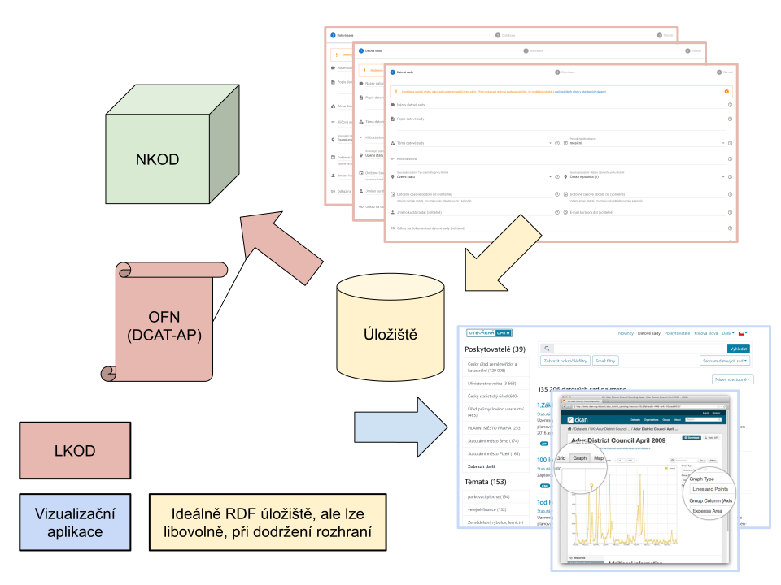

# Referenční implementace Lokálního katalogu otevřených dat (LKOD)
V tomto repozitáři popisujeme, jak lze již nyní zprovoznit jednoduchý lokální katalog otevřených dat (LKOD), který plně vyhovuje požadavkům [Národního katalogu otevřených dat](https://data.gov.cz) (NKOD), které mají formu [Otevřené formální normy (OFN) Rozhraní katalogů otevřených dat](https://ofn.gov.cz/rozhraní-katalogů-otevřených-dat/).
Dále v tomto repozitáři sbíráme další požadavky na referenční implementaci Lokálního katalogu otevřených dat.
Neslibujeme, že je všechny implementujeme, ale i tak se hodí je mít na jednom místě.
Pokud tedy máte požadavek na to, co by LKOD měl umět, [založte issue](https://github.com/opendata-mvcr/lkod/issues/new).

## CKAN ani DKAN nestačí
Aktuální rozšířené implementace datových katalogů [CKAN](https://ckan.org/) a [DKAN](https://getdkan.org/) nestačí.
Standardem pro metadata v Evropské unii je [DCAT-AP 2.0.0](https://joinup.ec.europa.eu/solution/dcat-application-profile-data-portals-europe/release/200), který vyžaduje například využívání EU slovníků a číselníků ([EU Vocabularies](https://publications.europa.eu/en/web/eu-vocabularies/about)), umožňuje mít vícejazyčná metadata a je založen na principu [Propojených dat](https://data.gov.cz/otevřené-formální-normy/propojená-data/).
CKAN ani DKAN i přes existenci různých [DCAT rozšíření](https://github.com/ckan/ckanext-dcat) nedosahují potřebné úrovně kompatibility.

## Co je potřeba pro kompatibilitu s NKOD
Nejprve je třeba si ujasnit, co je nezbytné pro dosažení kompatibility s NKOD.
Je to pouze poskytnutí strojového rozhraní odpovídajícího [OFN Rozhraní katalogů otevřených dat](https://ofn.gov.cz/rozhraní-katalogů-otevřených-dat/), a to ve variantě podle standardu DCAT-AP pomocí SPARQL endpointu. Uživatelské rozhraní není potřeba.
OFN se v čase vyvíjí podle toho, jak se vyvíjejí standardy DCAT a DCAT-AP a jak je podle nich rozšiřován NKOD.
Teď se to děje 2x ročně.
Rozhraní CKAN je podorováno pouze z důvodu zpětné kompatibility a nebude dále rozvíjeno - se standardem DCAT se rozchází čím dál více.
Rozhraní DCAT-AP v podobě jednotlivých dokumentů je podporováno jako kompromisní řešení tam, kde z různých důvodů nelze provozovat SPARQL endpoint, ale poskytovatel i tak chce využívat plné kompatibility katalogizačního záznamu s NKOD.

Způsob, jakým je rozhraní implementováno, OFN nespecifikuje. Lze ho tedy implementovat libovolně. Několik vybraných způsobů:
1. Ručně tvořené soubory s obsahem dle OFN, umístěné na web - toto lze použít pro malé, a ne často aktualizované LKODy. Toto řešení je však velmi levné a snadné.
2. Proprietární systém, který dané soubory (či SPARQL endpoint) zpřístupňuje.
3. Vlastní silou rozšířený katalog CKAN, DKAN či jiný, který poskytne rozhraní pro vkládání dat, a navíc se zajistí transformace těchto dat do formy dle OFN, například nástrojem LinkedPipes ETL (open-source).
4. Použití referenční implementace LKOD popsané v tomto repozitáři, nebo jejích částí.

## Referenční implementace LKOD
Referenční implementace je v tuto chvíli tvořena pomocí komponent v aktuální implementaci [Národního katalogu otevřených dat](https://github.com/opendata-mvcr/nkod).
Tato varianta používá výhradně open-source software a GitHub, je pro ni potřeba mít k dispozici (virtuální) server.
Aktuálně na ní běží například [LKOD MV ČR](https://data.mvcr.gov.cz).
Jednotlivé kroky či komponenty lze libovolně vyměňovat za jiné, za předpokladu dodržení rozhraní pro NKOD.

### Workflow referenční implementace
S touto implementací se pak pracuje následovně:
1. Pro tvorbu katalogizačního záznamu se využije [formulář pro vkládání záznamu do NKOD](https://data.gov.cz/formulář/registrace-datové-sady).
2. Výsledný JSON-LD soubor se nepošle datovou schránkou do NKOD, ale přidá se do něj ručně atribut `@id` obsahující unikátní IRI datové sady v lokálním katalogu, například takto:
```json
{
  "@id": "https://data.mvcr.gov.cz/zdroj/datové-sady/czechpoint/2007",
  "@type": [
    "http://www.w3.org/ns/dcat#Dataset",
```
3. Takto upravený soubor se nahraje na GitHub do repozitáře poskytovatele ([Příklad MV ČR](https://github.com/opendata-mvcr/lkod-mvcr)). GitHub zde řeší oprávnění uživatelů k editaci jednotlivých záznamů a automatizaci následného aktualizačního procesu.
4. GitHub po této akci automaticky zavolá tzv. Webhook, který spustí transformační proces v nástroji [LinkedPipes ETL](https://github.com/linkedpipes/etl).
5. Proces v LinkedPipes ETL stáhne záznamy z GitHub a nahraje je do SPARQL endpointu (rozhraní pro NKOD).
6. Volitelně, pokud je vyžadováno i uživatelské rozrhaní LKOD, LinkedPipes ETL ve stejném procesu připraví i data pro frontendovou část LKOD, která je realizována pomocí [LinkedPipes DCAT-AP Viewer](https://github.com/linkedpipes/dcat-ap-viewer), stejně jako v NKOD.

### Požadavky referenční implementace
- Server, kde LKOD poběží, nejlépe s OS Linux (Ubuntu, Debian, ...)
- [LinkedPipes ETL](https://github.com/linkedpipes/etl) - Open-source software pro transformace propojených dat
- Nějaká implementace SPARQL Endpointu. Například [Openlink Virtuoso Open-Source 7](https://github.com/openlink/virtuoso-opensource/), [Apache Jena Fuseki](https://jena.apache.org/documentation/fuseki2/), [Eclipse RDF4J](https://rdf4j.org/), [Blazegraph](https://blazegraph.com/) apod.
- Repozitář na GitHubu. Sem bude poskytovatel ukládat katalogizační záznamy.
- Volitelně [LinkedPipes DCAT-AP Viewer](https://github.com/linkedpipes/dcat-ap-viewer), pokud je vyžadováno i uživatelské rozhraní.
- Web server pro implementaci zabezpečení přístupu k jednotlivým komponentám a příjem Webhooks, např. [nginx](http://nginx.org/)
- Uživatel plnící LKOD musí umět pracovat s GitHubem a musí mít alespoň základní znalost formátu JSON.

## LKOD, NKOD a vizualizační aplikace
LKOD je vzhledem k NKOD tedy pouze rozhraní, které splňuje [Otevřenou formální normu (OFN) Rozhraní katalogů otevřených dat](https://ofn.gov.cz/rozhraní-katalogů-otevřených-dat/). Měl by poskytovateli umožnit pohodlně zadávat katalogizační záznamy, tak jako to teď dělá [formulář pro vkládání záznamu do NKOD](https://data.gov.cz/formulář/registrace-datové-sady). Další funkcionalita, jako uživatelské prohlížení záznamů či vizualizace dat jsou volitelnou, nikoliv nutnou součástí.



Tento repozitář je udržován v rámci projektu OPZ č. CZ.03.4.74/0.0/0.0/15_025/0004172.

